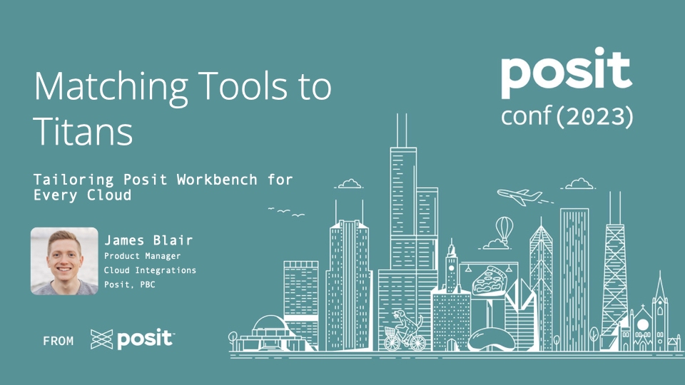

# Matching Tools to Titans: Tailoring Posit Workbench for Every Cloud

*In an era of diverse cloud platforms, leveraging tools effectively is
paramount. This talk highlights the adaptability of Posit Workbench within
leading cloud platforms. Delve into strategic integrations, understand key
challenges, and uncover practical solutions. By the end, attendees will be
equipped with insights to harness Posit Workbench's capabilities seamlessly
across varied cloud environments.*

